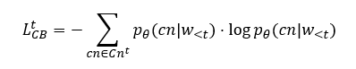

# Improving Neural Text Generation with Confidence-Boost Training
Forked from [Welleck et al.](https://github.com/facebookresearch/unlikelihood_training)

PyTorch implementation of the thesis (work in progress):

**Improving Neural Text Generation with Confidence-Boost Training**\
Salahuddin Muhammad Iqbal, Dae-ki Kang

The rest of setup similar to the original implementation of:

Paper: [Neural Text Generation with Unlikelihood Training](https://arxiv.org/pdf/1908.04319.pdf) \
Code: [github](https://github.com/facebookresearch/unlikelihood_training)

We include our own objective (CB) as auxilary loss to MLE that preventing repetitive tokens. 

We define our objective function as:

Where each cn is a contender (past tokens and a gold token). We then add it to the MLE loss as auxiliary loss.

## Result
Table 1 Result of each model with respective loss on validation split of Wikipedia-103k
Model | seq-rep-4  | uniq | uniq-seq | ppl | acc | rep |
--|--|--|--|--|--|--|
MLE|    0.497|    12,727|     9,305|**23.593**|    0.412|    0.605|
ULT|    0.361|    13,460|    10,520|    24.777|    0.409|    0.561|
CBT|**0.298**|**13,940**|**10,612**|    30.369|**0.412**|**0.558**|

Our model (CBT) improves standard Maximum Likelihood Estimation (MLE) objective as well as Unlikelihood Training (ULT) in terms of token level and sequence level repetition.